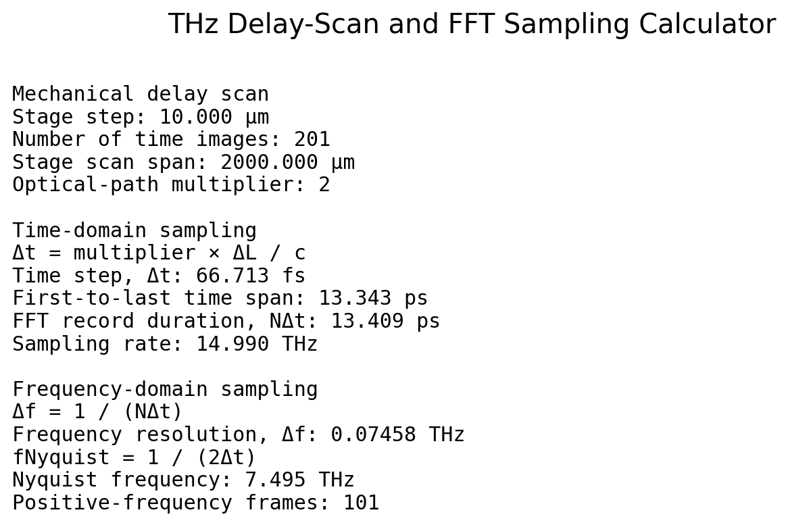
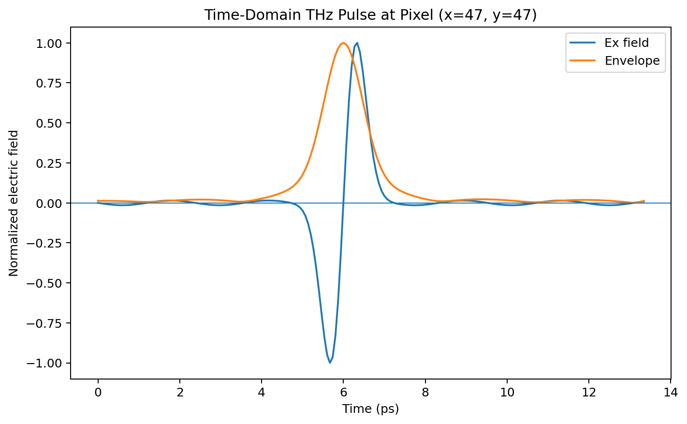
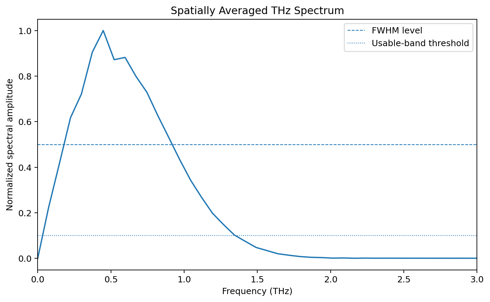
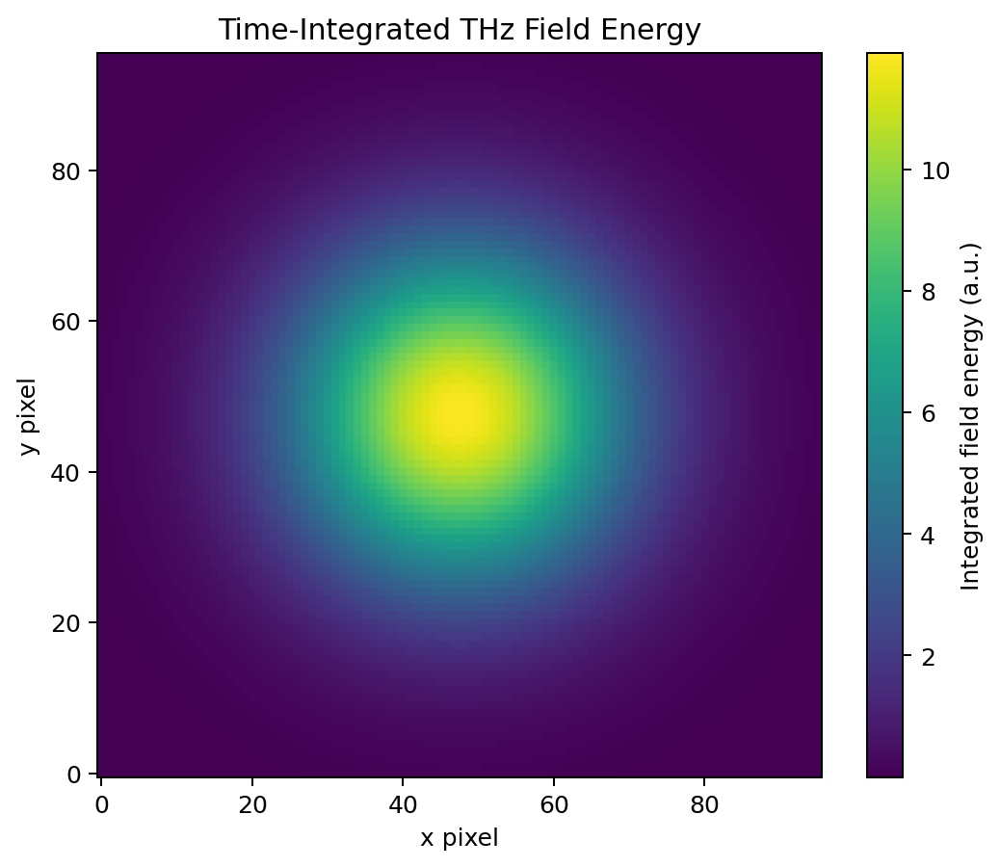
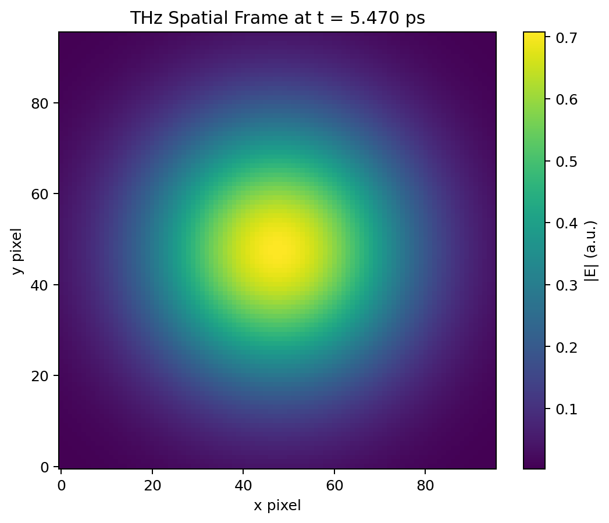
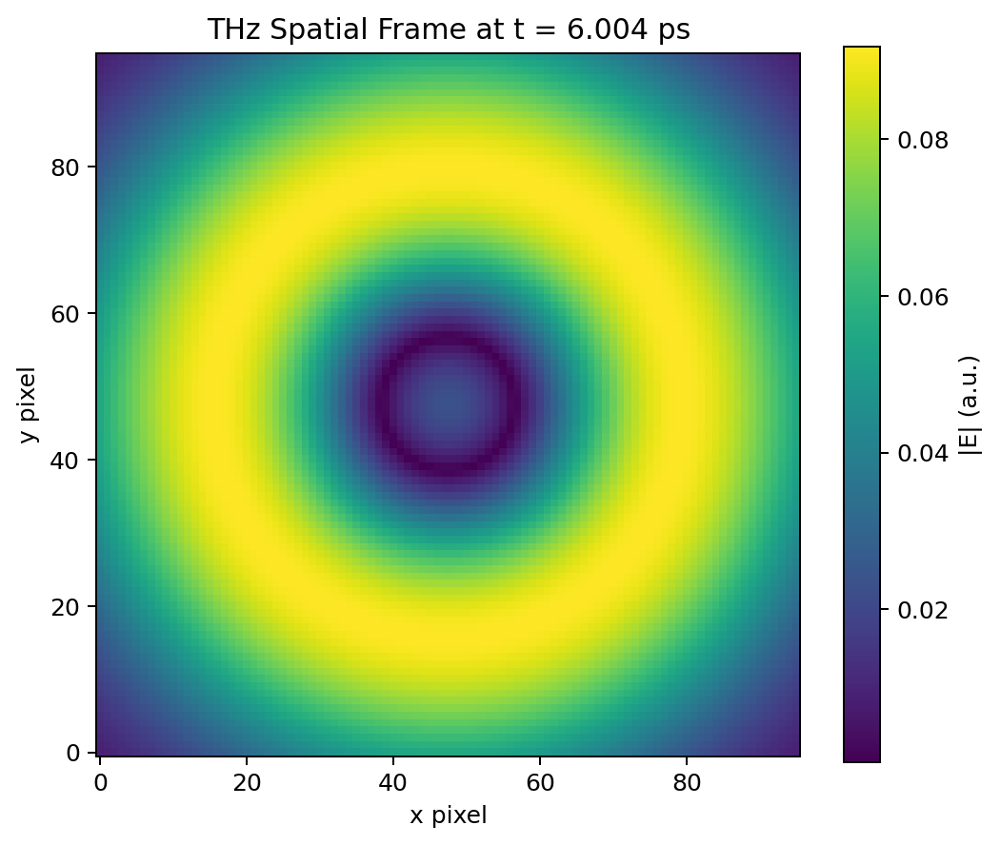
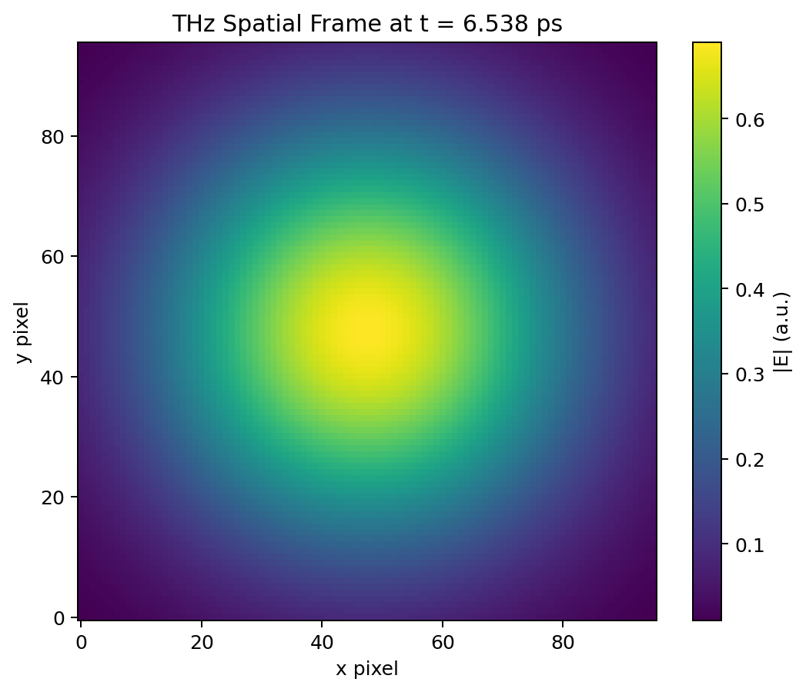
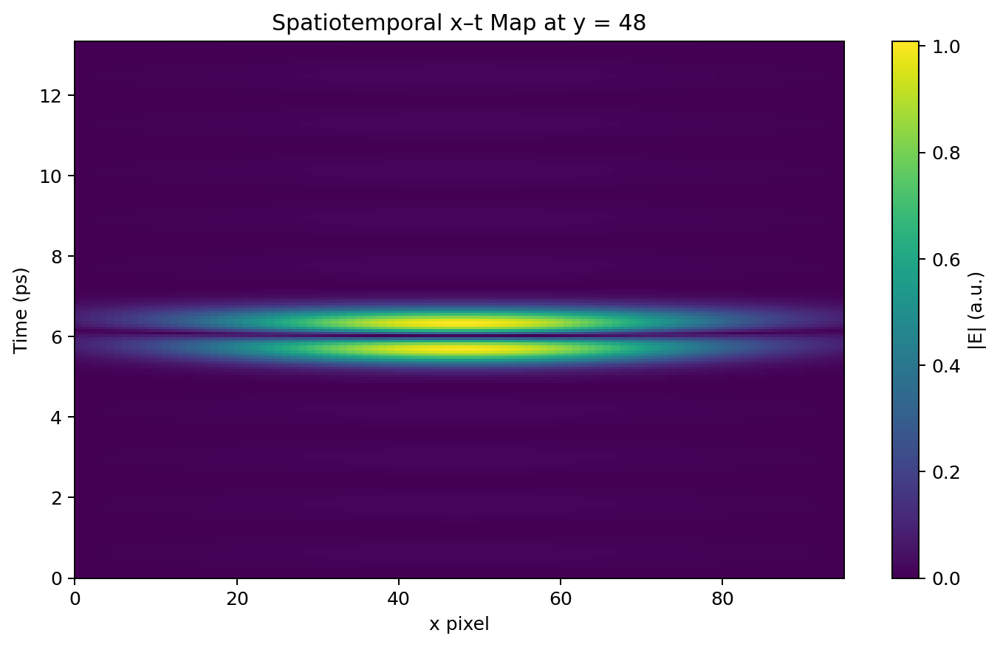

# Spatiotemporal THz Electric-Field Report

Dataset: **Synthetic radially polarized single-cycle THz pulse**

## 1. What was recorded?

A camera records one two-dimensional electric-field image at each delay position.
Stacking the images creates a three-dimensional movie:

\[
E_x(x,y,t), \qquad E_y(x,y,t)
\]

- \(x,y\): position in the camera image
- \(t\): pump–probe delay
- each time image is one **time-domain frame**
- the FFT along \(t\) creates frequency images \(E_x(x,y,f)\) and \(E_y(x,y,f)\)

## 2. Delay-scan calculations

| Quantity | Result |
|---|---:|
| Stage step | 10.000 µm |
| Number of time-domain images | 201 |
| Stage scan span | 2000.000 µm |
| Optical-path multiplier | 2 |
| Time step, Δt | 66.713 fs |
| First-to-last time span | 13.3426 ps |
| FFT record duration, NΔt | 13.4093 ps |
| Frequency resolution, Δf | 0.07458 THz |
| Nyquist frequency | 7.4948 THz |
| Positive-frequency frames | 101 |

The equations are:

\[
\Delta t = \frac{m\,\Delta L}{c}
\]

\[
\Delta f = \frac{1}{N\Delta t}
\]

\[
f_{\mathrm{Nyquist}} = \frac{1}{2\Delta t}
\]

where \(m=2\) for a retroreflector delay line.

## 3. Pulse and bandwidth results

| Quantity | Result |
|---|---:|
| Reference pixel | x=47, y=47 |
| Dominant field component | Ex |
| Pulse peak time | 6.0042 ps |
| Time-domain pulse width (envelope FWHM) | 1.0674 ps |
| Spectral peak | 0.4475 THz |
| Spectral FWHM range | 0.2237–0.8949 THz |
| Spectral FWHM bandwidth | 0.6712 THz |
| 10% usable range | 0.0746–1.3424 THz |
| Frequency frames above threshold | 18 |

## 4. Visual explanation

### Scan calculator

### Time-domain pulse

### Frequency spectrum

### Time-integrated energy

### Three time-domain image frames

### Spatiotemporal x–t map

### Animated field movie
Open `outputs/demo/09_time_evolution.gif`.

## 5. Important interpretation

**Time resolution is not the same as pulse width.**

- Time step \(\Delta t\) tells how closely two measurements are separated.
- Pulse width tells how long the measured THz transient lasts.
- Frequency resolution \(\Delta f\) improves when the time window becomes longer.
- Nyquist frequency increases when the time step becomes smaller.
- Nyquist frequency is only a mathematical sampling limit; the experimentally
  useful bandwidth may be much smaller because of source, detector, optics,
  noise, and signal-to-noise ratio.

**Number of frequency frames**

For \(N\) real time-domain images, a real FFT produces:

\[
N_f = \left\lfloor \frac{N}{2} \right\rfloor + 1
\]

positive-frequency frames, including DC and the Nyquist bin when applicable.
Only a subset may contain useful THz signal.
